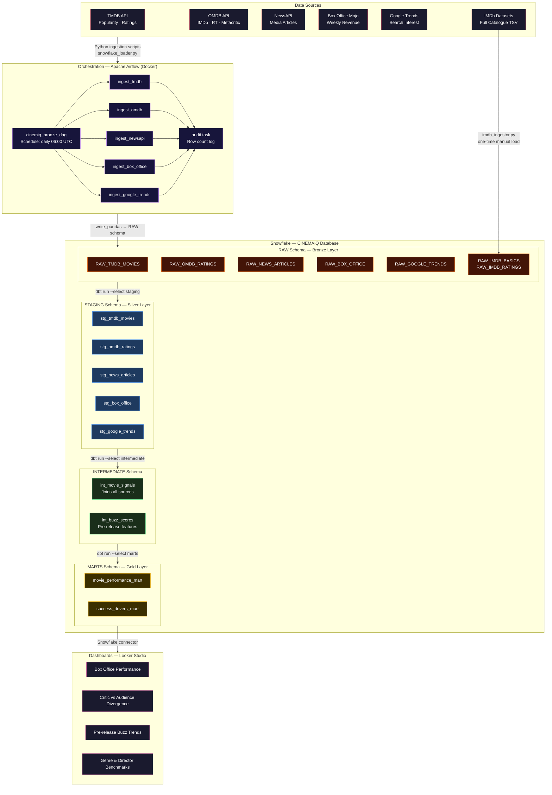

# CinemaIQ

> *An end-to-end data engineering pipeline that asks: what actually makes a movie succeed, and can data tell us before opening weekend?*

---

## The Story

Every Friday, hundreds of millions of dollars ride on a single question nobody can reliably answer: *Will this movie make money?*

Studios spend $200–300 million producing a blockbuster, then another $100–150 million marketing it, and still walk into opening weekend essentially guessing. Some films with massive budgets, A-list casts, and saturating advertising campaigns open to near-empty theatres. Others, made for a fraction of the cost with no stars, become cultural moments that run for months.

The conventional wisdom, big budget, big star, big opening, breaks down constantly. *Everything Everywhere All at Once* was made for $14 million and became one of the highest-grossing A24 films ever. *Indiana Jones and the Dial of Destiny* had $295 million, Harrison Ford, and the nostalgia of a 40-year franchise, and lost the studio an estimated $130 million. *Oppenheimer*, a 3-hour R-rated film about nuclear physics with no traditional "action hero," grossed $952 million worldwide. By conventional logic, none of these outcomes makes sense.

What if the signals were there all along, just scattered across the internet in places nobody was connecting?

Google Trends captures when public curiosity about a film starts spiking, weeks before release. News coverage volume tells you whether mainstream media is paying attention or ignoring a film entirely. The gap between what critics score a movie on Rotten Tomatoes versus what audiences rate it on IMDb predicts whether word-of-mouth will sustain it past the second weekend. Box office decay rates, which reveal how fast a film's weekly revenue drops, reveal the difference between a movie people recommend and one they tell their friends to skip.

None of these signals alone is enough. But assembled together, cleaned, joined, and analyzed as a unified dataset, they start to tell a story.

That is what **CinemaIQ** is built to do.

---

## What CinemaIQ Does

CinemaIQ is a production-grade data engineering pipeline that:

1. **Ingests** data daily from 5 sources: TMDB, OMDB, NewsAPI, Box Office Mojo, and Google Trends, plus a one-time load of the full IMDb public dataset (millions of movies)
2. **Stores** everything raw in Snowflake, preserving historical snapshots for trend analysis
3. **Transforms** the raw data through 3 layers using dbt cleaning, joining across sources, and building analytical tables
4. **Serves** the final data to Looker Studio dashboards and enables predictive analysis on box office outcomes

The pipeline is orchestrated by Apache Airflow running in Docker, runs daily automatically, and is built with the same patterns used at data-first companies.

---

## Architecture



---

## Data Sources

| Source | What it provides | Key signal |
|---|---|---|
| **TMDB API** | Movie metadata, popularity scores, ratings | Current audience demand |
| **OMDB API** | IMDb + Rotten Tomatoes + Metacritic in one call | `critic_audience_gap` divergence between critics and audiences |
| **NewsAPI** | Media articles about movies | Pre-release media buzz volume and sentiment |
| **Box Office Mojo** | Weekly domestic box office charts | Ground truth revenue the Y variable |
| **Google Trends** | Search interest over time | Public awareness before release (predictive signal) |
| **IMDb Datasets** | Ratings for millions of movies (full history) | Genre/director benchmarks, historical context |

---

## Tech Stack

| Layer | Tool | Why |
|---|---|---|
| Orchestration | Apache Airflow 2.8 | Industry standard, DAG-based scheduling, parallel tasks |
| Storage | Snowflake | Cloud data warehouse, scales to any size, native dbt integration |
| Transformation | dbt (data build tool) | SQL-first, version-controlled transformations with built-in testing |
| Containerisation | Docker + Docker Compose | Reproducible local Airflow environment |
| Language | Python 3.11 | Ingestion scripts, API calls, data loading |
| Dashboards | Looker Studio | Free, connects directly to Snowflake, shareable |

---

## Project Structure

```
cinemaiq/
│
├── ingestion/                   # Python scripts — one per data source
│   ├── tmdb_ingestor.py         # TMDB popular + top-rated movies
│   ├── omdb_ingestor.py         # Critic/audience scores + gap calculation
│   ├── newsapi_ingestor.py      # Movie news articles + headline sentiment
│   ├── box_office_ingestor.py   # Weekly box office (scraped from BOM)
│   ├── google_trends_ingestor.py# Search interest over time
│   ├── imdb_ingestor.py         # IMDb TSV file loader (run once)
│   └── snowflake_loader.py      # Shared loader: DataFrame → Snowflake RAW
│
├── dags/
│   └── cinemiq_bronze_dag.py    # Airflow DAG: 5 parallel tasks + audit
│
├── dbt_cinemiq/                 # All dbt transformation code
│   ├── dbt_project.yml
│   ├── packages.yml
│   ├── profiles.yml             # Copy to ~/.dbt/ — never commit
│   └── models/
│       ├── staging/             # Silver: clean + type each source
│       ├── intermediate/        # Joins across sources (Milestone 2)
│       └── marts/               # Gold: final analytical tables (Milestone 3)
│
├── config/
│   ├── snowflake_setup.sql      # Run once to create DB, schemas, roles
│   ├── verify_snowflake.sql     # Verification queries per milestone
│   └── test_connections.py      # Pre-flight check: tests all 4 connections
│
├── docker-compose.yml           # Airflow webserver + scheduler + Postgres
├── requirements_airflow.txt     # Airflow venv dependencies
├── requirements_dbt.txt         # dbt venv dependencies
└── .env.example                 # Credential template (never commit .env)
```

---

## Two Virtual Environments

Airflow and dbt cannot share a Python environment due to conflicting `sqlparse` version requirements. This project uses two separate venvs:

```
airflow_env/   →  use for: running ingestion scripts, loading data, Airflow
dbt_env/       →  use for: dbt run, dbt test, dbt debug
```

**Quick rule:** one terminal for each. Never activate both in the same session.

---

## Getting Started

### Prerequisites
- Python 3.11+
- Docker Desktop (running)
- Snowflake account (free trial works)
- API keys: TMDB (free), OMDB (free), NewsAPI (free)

### Setup

**1. Clone the repo**
```bash
git clone https://github.com/Duncan610/cinemaiq.git
cd cinemaiq
```

**2. Create your .env**
```bash
cp .env.example .env
# Fill in your API keys and Snowflake credentials
```

**3. Set up Snowflake**
```sql
-- Run config/snowflake_setup.sql in your Snowflake worksheet as ACCOUNTADMIN
-- This creates the CINEMAIQ database, all schemas, the service account, and warehouse
```

**4. Create the two virtual environments**
```bash
# Airflow environment
python -m venv airflow_env
source airflow_env/bin/activate        # Mac/Linux
pip install -r requirements_airflow.txt

# dbt environment (new terminal)
python -m venv dbt_env
source dbt_env/bin/activate
pip install -r requirements_dbt.txt
```

**5. Test all connections (airflow_env)**
```bash
source airflow_env/bin/activate
cd config
python test_connections.py
# All 4 must PASS before continuing
```

**6. Load IMDb data — one time (airflow_env)**
```bash
# Download title.basics.tsv.gz and title.ratings.tsv.gz from https://datasets.imdbws.com
cd ingestion
python imdb_ingestor.py \
  --basics  /path/to/title.basics.tsv.gz \
  --ratings /path/to/title.ratings.tsv.gz
```

**7. Start Airflow and run Bronze DAG (airflow_env)**
```bash
docker-compose up airflow-init   # first time only
docker-compose up -d
# Open http://localhost:8080  |  login: admin / admin
# Trigger: cinemiq_bronze_ingestion
```

**8. Run dbt Staging models (dbt_env)**
```bash
source dbt_env/bin/activate
cd dbt_cinemiq
dbt deps
cp profiles.yml ~/.dbt/profiles.yml    # fill in your credentials
dbt debug
dbt run --select staging
dbt test --select staging
```


## Author

**Duncan Otieno** — Analytics Engineering Portfolio Project  
Built to demonstrate end-to-end pipeline design using production-grade tools.

---

*"The data was always there. Nobody was looking at it all at once."*
